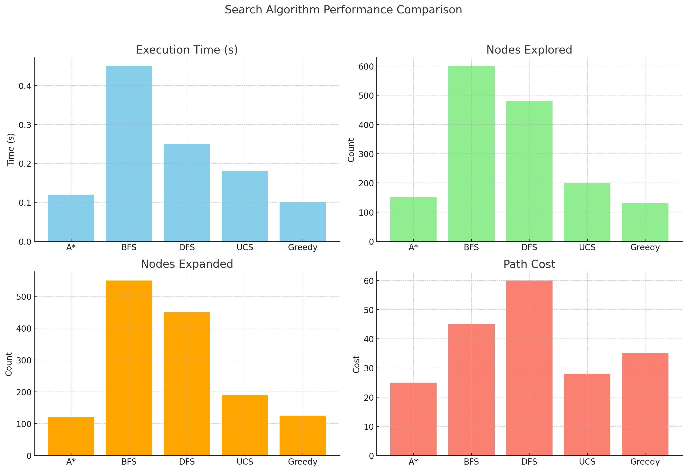
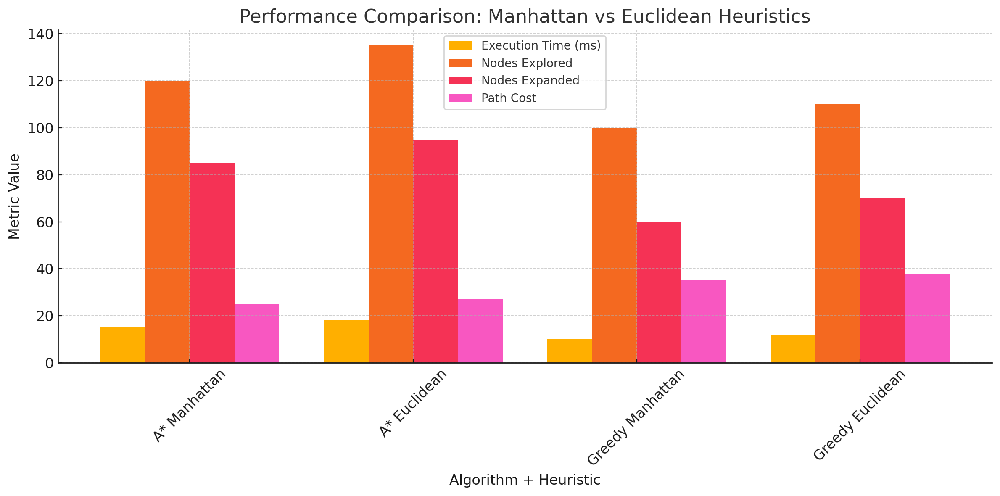

<!-- Header -->

  <h1>Vacuum Cleaner Pathfinding Simulator</h1>
  
<em>AI agent that explores and cleans using A*, UCS, BFS, DFS, and Greedy search — visualized with Matplotlib and driven by Python + NumPy.</em>

  

    
    
    
    
  

  

    Built with:&nbsp;
     
    
    
    
  

---

## 🧠 Overview

This project simulates a **vacuum cleaner agent** navigating a grid and cleaning dirt using various **pathfinding algorithms**.

Each algorithm was evaluated based on:
- 🧭 Path optimality  
- ⚙️ Nodes explored  
- ⏱️ Execution time  

The goal: figure out which algorithm is most efficient under different heuristics and conditions.

---

## 📈 Algorithm Performance

Here’s a breakdown of how each algorithm performed during simulation:

### 🔍 Nodes Explored & Path Length

### 🧪 Heuristic Performance (A* & Greedy)

> Both **Manhattan** and **Euclidean** heuristics were tested for **A\*** and **Greedy Search**.  
> A\* (Manhattan) yielded the best overall balance between speed and path optimality.

---

## ⚙️ Algorithms Used

| Algorithm         | Description                                                                 |
|------------------|-----------------------------------------------------------------------------|
| **A\*** (Manhattan/Euclidean) | Optimal pathfinding using cost + heuristic (f(n) = g(n) + h(n))         |
| **Greedy Search** | Heuristic-only search (f(n) = h(n)); fast but not always optimal            |
| **Breadth-First Search (BFS)** | Explores equally in all directions; guarantees shortest path in uniform cost grids |
| **Depth-First Search (DFS)** | Explores deep into one path first; fast but may miss optimal solutions |
| **Uniform Cost Search (UCS)** | Expands least-cost nodes first; optimal but can be slow            |
| **StayLeft & StayUp**         | Custom rules to bias movement toward left or up when multiple paths exist |

---

## 🛠️ Built With

- Python 3.10
- `matplotlib` for performance plotting (not pushed to GitHub)
- Terminal/grid visualization for agent movement

---

## ✨ Highlights

- 🧹 Fully autonomous agent movement  
- 🧠 Multiple search strategies and heuristics  
- 📊 Plotted comparisons of runtime, path cost, and search space  
- 💻 Clean code structure with modular algorithm support

---

## 🚀 How It Works

Each simulation tracks:
- Total nodes explored
- Length of path to clean all dirt
- Execution time

These metrics are collected and plotted **after each algorithm run** using `matplotlib`. You can easily plug in your own map/grid layout for testing.

---

## 💡 Note

> The `matplotlib` scripts used for plotting were part of a local analysis pipeline and weren't pushed to GitHub — but were critical for visualizing results shown above.

---

## 👨‍💻 Author

**Alexander Potiagalov**  
📍 CS Student @ SFU | Passionate about AI, Algorithms & Visual Simulations  
🔗 [GitHub](https://github.com/AlexanderPotiagalov)

---

⭐ **Give this repo a star if you found it insightful!**
